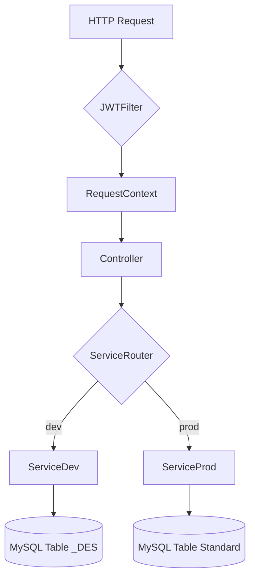

# Arquitectura del Sistema - Proveedores Family Cash

Documentación técnica sobre el diseño y flujo del backend.

## 1. Diseño Global

El sistema sigue un patrón **MVC (Model-View-Controller)** dentro de un ecosistema Spring Boot. La persistencia se gestiona mediante JPA/Hibernate y los archivos se almacenan de forma externa en un servidor FTP.

## 2. Gestión de Entornos Dinámica

Una de las características clave es la duplicidad de la lógica para soportar entornos de Producción y Desarrollo de forma simultánea sin despliegues independientes.

### Flujo de Enrutamiento:
1. **Filtro (JWTFilter)**: Extrae el contexto del token y los headers.
2. **RequestContext (RequestScope)**: Almacena el valor del header `X-Entorno`.
3. **Routers de Servicio**: Los componentes como `ProductoServiceRouter` inyectan el `RequestContext` y deciden a qué implementación de servicio delegar (`ProductoService` vs `ProductoServiceDes`).

## 3. Modelo de Datos

El modelo está duplicado físicamente en la base de datos para mantener aislamiento total de datos:

| Entidad | Tabla Prod | Tabla Dev | Responsabilidad |
|---------|------------|------------|-----------------|
| Producto | LU_ARA | LU_ARA_DES | Datos maestros de artículo |
| Imagen | LU_ARA_IMG | LU_ARA_IMG_DES | URLs de imágenes en FTP |
| Documento | LU_ARA_DOC | LU_ARA_DOC_DES| URLs de documentos adjuntos |
| Proveedor | LU_PROVEEDOR| LU_PROVEEDOR_DES| Usuarios del sistema |

## 4. Gestión de Archivos (FTP)

El almacenamiento no se realiza en disco local para facilitar la escalabilidad.
- **Protocolo**: FTP Binario.
- **Rutas**: Basadas en el ID de la entidad y el entorno.
- **Identidad**: Uso de UUID para imágenes y nomenclatura estructurada (`PROV_EAN_TIPO`) para documentos.

## 5. Seguridad Judicial

Aunque el sistema usa JWT, la seguridad se refuerza en la capa de servicio validando que el `proveedorId` de la petición (extraído del token) coincida con el propietario del recurso que se intenta modificar o consultar en endpoints de detalle.
